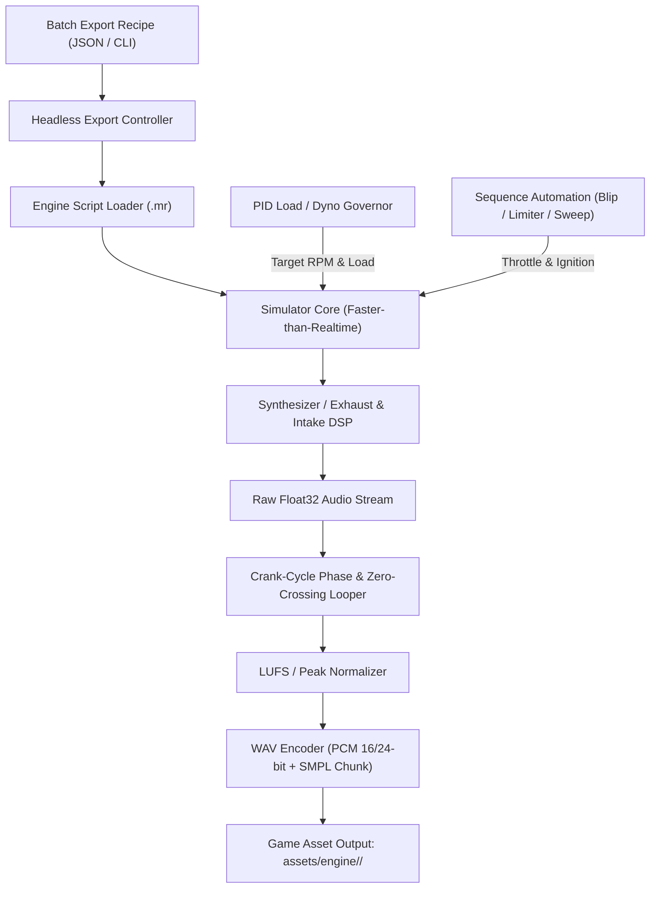

# Engine-Sim Headless Programmatic Audio Exporter Plan

A comprehensive engineering plan to modify the [`ange-yaghi/engine-sim`](https://github.com/ange-yaghi/engine-sim) C++ codebase. This plan adds a headless simulation pipeline, closed-loop RPM governor, crank-synchronized seamless looping engine, dynamic rev/limiter sequencer, and batch asset exporter to autonomously generate distinct, click-free game audio packs without manual recording or Audacity editing.

---

## 1. High-Level Architecture



---

## 2. Core Components to Build in `engine-sim`

### Component A: Headless Simulation Runner (Non-Realtime / Faster-Than-Realtime)

**Goal:** Run the engine simulation and acoustic DSP loop decoupled from real-time clock, OS window, OpenGL/ImGui UI, and OS audio output hardware.

1. **Simulation Stepping**:
   - Decouple `Simulator::update()` and `AudioEngine` from real-time wall clock.
   - Run simulation in fixed time steps $dt = \frac{1}{\text{AudioSampleRate}}$ (typically $44.1\text{ kHz}$ or $48\text{ kHz}$, with physical sub-stepping e.g. $10\text{x}$ or $20\text{x}$ per sample as in engine-sim's native solver).
   - Render directly to an in-memory `std::vector<float>` audio buffer at maximum CPU speed (10–50x faster than real-time).

2. **Headless Entrypoint / Mode Switch**:
   - Add a command-line mode flag: `engine-sim --export-audio <recipe.json>` or `engine-sim --headless ...`.
   - Skip window creation (`SDL_CreateWindow` / `glad` / `ImGui` initialization) when in headless mode.

---

### Component B: Closed-Loop Virtual Dyno & RPM Governor

**Goal:** Automatically hold the engine at exact, stable target RPMs (e.g. 1000, 2000, 3000... 7000 RPM) under steady-state combustion load.

1. **PID Throttle & Dyno Load Controller**:
   - Implement a closed-loop controller that adjusts both throttle position $\theta \in [0.0, 1.0]$ and dyno load torque $T_{\text{brake}}$:
     $$\text{Error} = \text{RPM}_{\text{target}} - \text{RPM}_{\text{actual}}$$
     $$T_{\text{brake}} = K_p e(t) + K_i \int e(t) dt + K_d \frac{de(t)}{dt}$$
2. **Settling Detection**:
   - Simulate a configurable warm-up / settling window (e.g. 0.5s–1.0s) until $\sigma(\text{RPM}) < 5\text{ RPM}$ before recording audio frames.

---

### Component C: Automated Seamless Looper (Crank-Synchronous Zero-Crossing)

**Goal:** Generate 100% clickless, phase-aligned loops without manual Audacity trimming.

1. **Exact 720° Crank Cycle Duration**:
   - For a 4-stroke engine, one complete thermodynamic cycle equals exactly 2 crankshaft revolutions ($720^\circ$ or $4\pi\text{ rad}$).
   - At a steady angular velocity $\omega\text{ (rad/s)}$, the exact cycle duration is:
     $$T_{\text{cycle}} = \frac{4\pi}{\omega} = \frac{120}{\text{RPM}}\text{ seconds}$$
     $$N_{\text{samples\_per\_cycle}} = T_{\text{cycle}} \times \text{SampleRate}$$
2. **Phase-Aligned Loop Slicing**:
   - Track crank angle $\theta_{\text{crank}} \pmod{4\pi}$.
   - Start recording at $\theta_{\text{crank}} = 0$ (Top Dead Center of Cylinder 1).
   - Extract an integer number of full combustion cycles $K$ (e.g., $K = 4$ to $8$ engine cycles, producing ~0.5s–1.5s loops).
   - Apply micro-crossfade ($16$–$64$ samples) or exact zero-crossing snap to ensure boundary continuity:
     $$y[0] = y[N], \quad y'[0] = y'[N]$$
3. **Loop Metadata**:
   - Embed standard WAV `smpl` chunk so game engines (Godot, FMOD, Wwise) recognize loop points automatically.

---

### Component D: Action & Transient Sequencer

**Goal:** Record dynamic sound events (Rev Blips, Rev Limiter Bounces, Throttle Dumps).

1. **Rev-Blip Generator**:
   - Idle engine at baseline RPM (e.g. 1000 RPM).
   - Apply a throttle impulse curve:
     $$\theta(t) = \begin{cases} \sin^2\left(\frac{\pi t}{2 t_{\text{rise}}}\right) & 0 \le t \le t_{\text{rise}} \\ e^{-\frac{t - t_{\text{rise}}}{\tau}} & t > t_{\text{rise}} \end{cases}$$
   - Record from blip onset until return to idle.
2. **Rev Limiter Bounce Generator**:
   - Hold throttle at 100% against the engine's hard/soft rev limiter cutoff.
   - Record 2–4 seconds of steady rev limiter oscillation (spark cut / fuel cut pressure pulses).
3. **Decel / Crackle & Pop**:
   - Run at 6000 RPM under load, then slam throttle to 0% with rich overrun timing to capture aggressive exhaust backfires and crackles.

---

### Component E: WAV Exporter & LUFS Normalizer

1. **Normalization**:
   - True Peak limiter (-0.5 dBFS) and consistent RMS/LUFS normalization across all RPM layers so engine sound pitch-blending in-game remains smooth.
2. **WAV File Writing**:
   - Write standard RIFF WAV files (16-bit / 24-bit PCM at 44.1 kHz or 48 kHz).

---

### Component F: Batch Export Engine (`recipe.json`)

**Goal:** Generate complete audio suites for multiple engine definitions in a single command.

Example Batch Recipe Specification:

```json
{
  "engines": [
    {
      "name": "v8_muscle",
      "engine_file": "engines/v8_crossplane.mr",
      "outputs": [
        { "type": "steady_rpm", "rpm_start": 1000, "rpm_end": 7000, "rpm_step": 500, "cycles": 6 },
        { "type": "rev_blip", "peak_rpm": 5500, "duration": 1.2 },
        { "type": "rev_limiter", "duration": 2.5 }
      ]
    },
    {
      "name": "i4_tuner",
      "engine_file": "engines/inline4_high_rev.mr",
      "outputs": [
        { "type": "steady_rpm", "rpm_start": 1000, "rpm_end": 9000, "rpm_step": 500, "cycles": 8 },
        { "type": "rev_blip", "peak_rpm": 7500, "duration": 1.0 },
        { "type": "rev_limiter", "duration": 2.5 }
      ]
    }
  ]
}
```

---

## 3. Vehicle Sound Pack Mapping for Super Drag Racer 3000

| Vehicle      | In-Game Car   | Engine Architecture                       | Sound Characteristics                             | Target Redline |
| :----------- | :------------ | :---------------------------------------- | :------------------------------------------------ | :------------- |
| **Grizzly**  | Pickup        | Heavy 6.6L Big Block V8 / Turbo Diesel    | Low frequency, deep rumble, high torque chug      | 5000 RPM       |
| **Crusher**  | Monster Truck | 8.2L Supercharged V8 with Blower Whine    | Massive displacement throb, violent exhaust pop   | 5400 RPM       |
| **Chariot**  | Taxi          | 3.5L Fleet V6 Naturally Aspirated         | Smooth, muted drone, steady commuter hum          | 6000 RPM       |
| **Trench**   | Muscle 1      | 7.0L Classic American Crossplane V8       | Iconic uneven idle lope, guttural mid-range bark  | 6200 RPM       |
| **Vendetta** | Muscle 2      | 6.2L Modern Supercharged Hemispherical V8 | Screaming supercharger whine + heavy exhaust roar | 6600 RPM       |
| **Glacier**  | SUV           | 4.0L Twin-Turbo High-Output V8            | Refined bass rumble with turbo spool & blowoff    | 6600 RPM       |
| **Aileron**  | Sedan         | 2.5L Turbocharged DOHC Inline-4           | Clean street tuner tone with crisp induction      | 6800 RPM       |
| **Tachyon**  | Hatchback     | 2.0L High-Boost High-Cam Inline-4         | Snappy, raspy high-frequency exhaust notes        | 7200 RPM       |
| **Mantis**   | Roadster      | 2.0L 9000-RPM DOHC Screamer / Rotary      | High-pitched motorcycle-like howl                 | 8800 RPM       |
| **Pulse**    | Sports        | 5.2L Flatplane V10 Exotic                 | Screaming Formula-style harmonics, fast rev climb | 9000 RPM       |

---

## 4. Proposed Source Code Modifications in `engine-sim`

### 1. `include/audio_exporter.h` & `src/audio_exporter.cpp` [NEW]

- Implements `AudioExporter` class.
- Manages non-realtime audio buffer recording, crank phase tracking, cycle-based zero-crossing loop extraction, and RIFF WAV encoding with `smpl` chunk.

### 2. `include/rpm_governor.h` & `src/rpm_governor.cpp` [NEW]

- Implements PID governor controlling engine throttle and dynamometer load to hold exact target RPMs.

### 3. `include/export_recipe.h` & `src/export_recipe.cpp` [NEW]

- Parses JSON batch recipes and drives the export pipeline.

### 4. `src/main.cpp` & `src/simulator.cpp` [MODIFY]

- Adds `--headless` and `--export-audio <recipe.json>` command-line handling.
- Bypasses SDL window/renderer initialization and real-time audio device binding when running headless.

---

## 5. Verification & Validation Plan

### Automated C++ / CLI Tests

1. **Headless Execution Verification**:
   - Run `engine-sim --export-audio recipe_test.json` headless.
   - Verify process exits cleanly with code 0 without creating OpenGL contexts or SDL audio streams.
2. **Audio File Integrity & Loop Continuity**:
   - Check generated `.wav` files have exact sample rates (44.1 kHz / 48 kHz).
   - Test loop seam continuity by computing sample delta $|y[0] - y[N]|$ and spectral continuity across loop boundary.
3. **RPM Accuracy Verification**:
   - Verify FFT frequency of generated audio matches $f_{\text{combustion}} = \frac{\text{RPM}}{120} \times N_{\text{cylinders}}$.

### In-Game Godot Integration

1. Place exported sound packs in `assets/engine/<car_type>/` (e.g. `assets/engine/muscle/`, `assets/engine/tuner/`).
2. Update game vehicle audio player to use multi-sample RPM crossfading per vehicle archetype.
3. Run `npm run test` to verify zero regression in smoke test suite.
