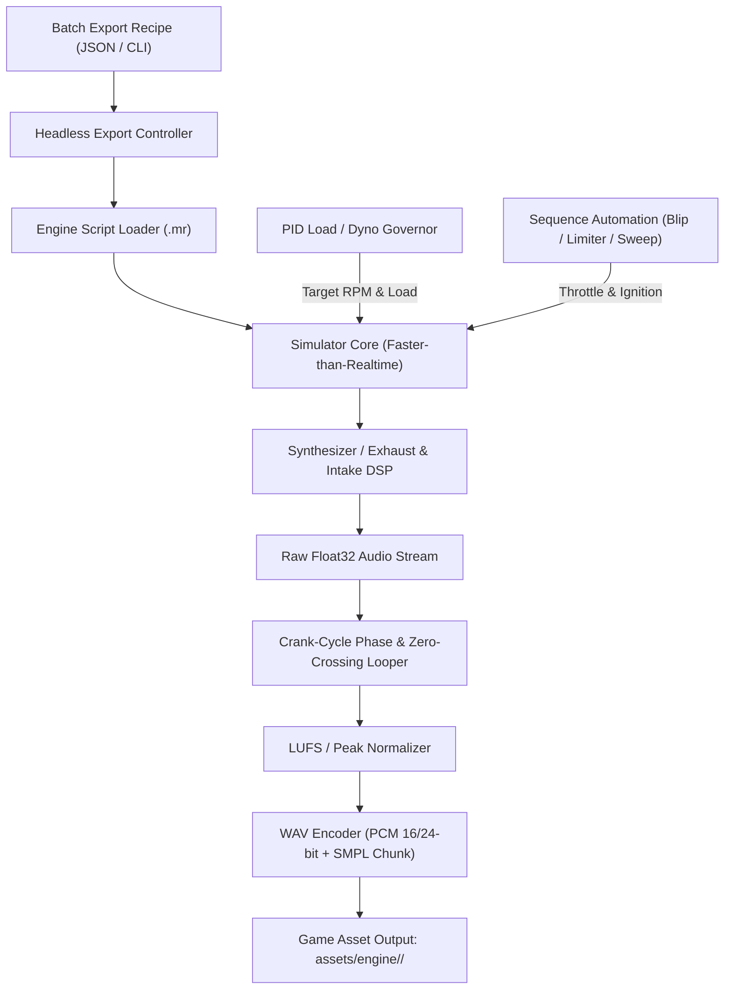

# Engine-Sim Headless Programmatic Audio Exporter Plan

A comprehensive engineering plan to modify the [`ange-yaghi/engine-sim`](https://github.com/ange-yaghi/engine-sim) C++ codebase. This plan adds a headless simulation pipeline, closed-loop RPM governor, crank-synchronized seamless looping engine, dynamic rev/limiter sequencer, and batch asset exporter to autonomously generate distinct, click-free game audio packs without manual recording or Audacity editing.

---

## 1. High-Level Architecture



---

## 2. Core Components to Build in `engine-sim`

### Component A: Headless Simulation Runner (Non-Realtime / Faster-Than-Realtime)

**Goal:** Run the engine simulation and acoustic DSP loop decoupled from real-time clock, OS window, OpenGL/ImGui UI, and OS audio output hardware.

1. **Simulation Stepping**:
   - Decouple `Simulator::update()` and `AudioEngine` from real-time wall clock.
   - Run simulation in fixed time steps $dt = \frac{1}{\text{AudioSampleRate}}$ (typically $44.1\text{ kHz}$ or $48\text{ kHz}$, with physical sub-stepping e.g. $10\text{x}$ or $20\text{x}$ per sample as in engine-sim's native solver).
   - Render directly to an in-memory `std::vector<float>` audio buffer at maximum CPU speed (10–50x faster than real-time).

2. **Headless Entrypoint / Mode Switch**:
   - Add a command-line mode flag: `engine-sim --export-audio <recipe.json>` or `engine-sim --headless ...`.
   - Skip window creation (`SDL_CreateWindow` / `glad` / `ImGui` initialization) when in headless mode.

---

### Component B: Closed-Loop Virtual Dyno & RPM Governor

**Goal:** Automatically hold the engine at exact, stable target RPMs (e.g. 1000, 2000, 3000... 7000 RPM) under steady-state combustion load.

1. **PID Throttle & Dyno Load Controller**:
   - Implement a closed-loop controller that adjusts both throttle position $\theta \in [0.0, 1.0]$ and dyno load torque $T_{\text{brake}}$:
     $$\text{Error} = \text{RPM}_{\text{target}} - \text{RPM}_{\text{actual}}$$
     $$T_{\text{brake}} = K_p e(t) + K_i \int e(t) dt + K_d \frac{de(t)}{dt}$$
2. **Settling Detection**:
   - Simulate a configurable warm-up / settling window (e.g. 0.5s–1.0s) until $\sigma(\text{RPM}) < 5\text{ RPM}$ before recording audio frames.

---

### Component C: Automated Seamless Looper (Crank-Synchronous Zero-Crossing)

**Goal:** Generate 100% clickless, phase-aligned loops without manual Audacity trimming.

1. **Exact 720° Crank Cycle Duration**:
   - For a 4-stroke engine, one complete thermodynamic cycle equals exactly 2 crankshaft revolutions ($720^\circ$ or $4\pi\text{ rad}$).
   - At a steady angular velocity $\omega\text{ (rad/s)}$, the exact cycle duration is:
     $$T_{\text{cycle}} = \frac{4\pi}{\omega} = \frac{120}{\text{RPM}}\text{ seconds}$$
     $$N_{\text{samples\_per\_cycle}} = T_{\text{cycle}} \times \text{SampleRate}$$
2. **Phase-Aligned Loop Slicing**:
   - Track crank angle $\theta_{\text{crank}} \pmod{4\pi}$.
   - Start recording at $\theta_{\text{crank}} = 0$ (Top Dead Center of Cylinder 1).
   - Extract an integer number of full combustion cycles $K$ (e.g., $K = 4$ to $8$ engine cycles, producing ~0.5s–1.5s loops).
   - Apply micro-crossfade ($16$–$64$ samples) or exact zero-crossing snap to ensure boundary continuity:
     $$y[0] = y[N], \quad y'[0] = y'[N]$$
3. **Loop Metadata**:
   - Embed standard WAV `smpl` chunk so game engines (Godot, FMOD, Wwise) recognize loop points automatically.

---

### Component D: Action & Transient Sequencer

**Goal:** Record dynamic sound events (Rev Blips, Rev Limiter Bounces, Throttle Dumps).

1. **Rev-Blip Generator**:
   - Idle engine at baseline RPM (e.g. 1000 RPM).
   - Apply a throttle impulse curve:
     $$\theta(t) = \begin{cases} \sin^2\left(\frac{\pi t}{2 t_{\text{rise}}}\right) & 0 \le t \le t_{\text{rise}} \\ e^{-\frac{t - t_{\text{rise}}}{\tau}} & t > t_{\text{rise}} \end{cases}$$
   - Record from blip onset until return to idle.
2. **Rev Limiter Bounce Generator**:
   - Hold throttle at 100% against the engine's hard/soft rev limiter cutoff.
   - Record 2–4 seconds of steady rev limiter oscillation (spark cut / fuel cut pressure pulses).
3. **Decel / Crackle & Pop**:
   - Run at 6000 RPM under load, then slam throttle to 0% with rich overrun timing to capture aggressive exhaust backfires and crackles.

---

### Component E: WAV Exporter & LUFS Normalizer

1. **Normalization**:
   - True Peak limiter (-0.5 dBFS) and consistent RMS/LUFS normalization across all RPM layers so engine sound pitch-blending in-game remains smooth.
2. **WAV File Writing**:
   - Write standard RIFF WAV files (16-bit / 24-bit PCM at 44.1 kHz or 48 kHz).

---

### Component F: Batch Export Engine (`recipes/game_vehicles.json`)

**Goal:** Generate complete audio suites for multiple engine definitions in a single command.

Example Batch Recipe Specification (`recipes/game_vehicles.json`):

```json
{
  "global_settings": {
    "output_dir": "assets/audio/engines",
    "sample_rate": 44100,
    "bits_per_sample": 16,
    "normalize_peak_dbfs": -1.0,
    "embed_loop_markers": true,
    "default_cycles_per_loop": 6,
    "default_min_loop_duration_sec": 1.0
  },
  "search_paths": ["assets", "assets/engines", "part-library"],
  "vehicles": [
    {
      "id": "trench",
      "display_name": "Trench (MUSCLE) — Raw Muscle",
      "script_path": "assets/engines/atg-video-2/07_gm_ls.mr",
      "export_profile": {
        "rpm_min": 900,
        "rpm_max": 6200,
        "rpm_step": 500,
        "cycles_per_loop": 6,
        "min_loop_duration_sec": 1.0,
        "export_steady_rpm": true,
        "export_rev_limiter": true,
        "export_rev_blip": true,
        "export_decel_crackle": true
      }
    }
  ]
}
```

---

## 3. Vehicle Sound Pack Mapping for Super Drag Racer 3000 (21 Vehicles)

| Tier | Vehicle (ID) | In-Game Car / Role | Engine Script Path | Engine Architecture | Sound Characteristics | RPM Range / Target Redline |
| :---: | :----------- | :----------------- | :----------------- | :------------------ | :-------------------- | :------------------------- |
| **C** | **Trench** (`trench`) | Classic Pony (`RAW_MUSCLE`) | `assets/engines/atg-video-2/07_gm_ls.mr` | 5.7L Classic Crossplane V8 | Iconic uneven idle lope, guttural mid-range bark | 900 – 6200 RPM (Redline: 6200) |
| **C** | **Aileron** (`aileron`) | Street Sedan (`BALANCED_STREET`) | `assets/engines/atg-video-1/06_subaru_ej25.mr` | 2.5L Turbo Boxer-4 (Subaru EJ25) | Clean street tuner tone with crisp induction | 900 – 6800 RPM (Redline: 6800) |
| **C** | **Grizzly** (`grizzly`) | Utility Truck (`HEAVY_UTILITY`) | `assets/engines/chevrolet/chev_truck_454.mr` | 7.4L (454ci) Big Block V8 | Low frequency, deep rumble, heavy low-end torque chug | 800 – 5000 RPM (Redline: 5000) |
| **C** | **Tachyon** (`tachyon`) | Tuner Starter (`SNAPPY_TUNER`) | `assets/engines/atg-video-1/05_honda_vtec.mr` | High-Cam DOHC VTEC Inline-4 | Snappy, raspy high-frequency exhaust notes, high-cam scream | 1000 – 7200 RPM (Redline: 7200) |
| **C** | **Hauler** (`hauler`) | Classic Work Van (`HEAVY_UTILITY`) | `assets/engines/atg-video-2/06_even_fire_v6.mr` | 3.8L Utilitarian Even-Fire V6 | Heavy utilitarian drone, steady commercial engine hum | 800 – 5200 RPM (Redline: 5200) |
| **C** | **Chariot** (`chariot`) | Bonus Sleeper Taxi (`BALANCED_STREET`) | `assets/engines/atg-video-2/03_2jz.mr` | 3.0L Twin-Cam Inline-6 (Toyota 2JZ) | Smooth inline-6 turbine drone, sleeper turbo whistle | 800 – 6500 RPM (Redline: 6500) |
| | | | | | | |
| **B** | **Crusher** (`crusher`) | Wildcard Monster (`HEAVY_UTILITY`) | `assets/engines/custom/monster_truck_540_blown_v8.mr` | 540ci Supercharged Big-Block V8 | Unbaffled open zoomie headers, violent blower lope & backfires | 900 – 5400 RPM (Redline: 5400) |
| **B** | **Marauder** (`marauder`) | Big-Block Muscle (`RAW_MUSCLE`) | `assets/engines/custom/chevy_427_l88_v8.mr` | 7.0L (427ci) L88 Big Block V8 | Radical solid-lifter high-lift cam chop, massive carbureted roar | 850 – 6200 RPM (Redline: 6200) |
| **B** | **Vanguard** (`vanguard`) | Luxury AWD Box (`AWD_HEAVY`) | `assets/engines/custom/mercedes_amg_m177_v8_4_0l.mr` | 4.0L BiTurbo V8 (AMG M177) | Deep Hot-V crossplane AMG burble with aggressive overrun crackles | 850 – 6400 RPM (Redline: 6400) |
| **B** | **Mantis** (`mantis`) | Agile Roadster (`SNAPPY_TUNER`) | `assets/engines/atg-video-1/04_hayabusa.mr` | 1.3L High-Rev DOHC Inline-4 | High-pitched motorcycle howl, screaming ultra-fast rev climb | 1100 – 8800 RPM (Redline: 8800) |
| **B** | **Corsair** (`corsair`) | Rally AWD (`SNAPPY_TUNER`) | `assets/engines/atg-video-2/02_subaru_ej25_uh.mr` | 2.5L Turbo Boxer-4 (Unequal Headers) | Iconic unequal-length WRC boxer rumble, turbo spool & thrum | 950 – 7000 RPM (Redline: 7000) |
| | | | | | | |
| **A** | **Nomad** (`nomad`) | Offroad 4x4 Beast (`HEAVY_UTILITY`) | `assets/engines/custom/chrysler_hemi_392_v8.mr` | 6.4L (392ci) SRT HEMI V8 | Hemispherical combustion thrum, deep bass offroad torque pulse | 850 – 6000 RPM (Redline: 6000) |
| **A** | **Vendetta** (`vendetta`) | Supercharged Muscle (`RAW_MUSCLE`) | `assets/engines/atg-video-2/07_gm_ls.mr` | High-Output Crossplane V8 | Aggressive crossplane roar, heavy exhaust thrum, extended top end | 850 – 6600 RPM (Redline: 6600) |
| **A** | **Glacier** (`glacier`) | Performance SUV (`AWD_HEAVY`) | `assets/engines/atg-video-1/07_audi_i5.mr` | 2.2L Turbocharged Inline-5 (Audi I5) | Distinctive 5-cylinder warble, turbo boost roar & off-beat pulse | 850 – 6600 RPM (Redline: 6600) |
| **A** | **Stratus** (`stratus`) | German Sport Sedan (`BALANCED_STREET`) | `assets/engines/bmw/M52B28.mr` | 2.8L DOHC 24V Straight-Six (BMW M52) | Pure, singing German sport straight-six harmonics | 900 – 7200 RPM (Redline: 7200) |
| **A** | **Helix** (`helix`) | Widebody Tuner (`SNAPPY_TUNER`) | `assets/engines/custom/nissan_rb26dett_i6.mr` | 2.6L Twin-Turbo DOHC I6 (RB26DETT) | High-RPM metallic Japanese straight-six scream with 6-ITB bite | 1000 – 8500 RPM (Redline: 8500) |
| | | | | | | |
| **S** | **Monarch** (`monarch`) | Land Yacht Cruiser (`BALANCED_STREET`) | `assets/engines/atg-video-2/11_merlin_v12.mr` | 27.0L Supercharged V12 (RR Merlin) | Colossal 1860 HP aircraft engine thunder, deep supercharged pulses | 800 – 3800 RPM (Redline: 3800) |
| **S** | **Mamba** (`mamba`) | 8.4L V10 Monster (`RAW_MUSCLE`) | `assets/engines/custom/dodge_viper_v10_8_4l.mr` | 8.4L (512ci) VX I Odd-Fire V10 (Viper) | Heavy odd-fire (54°/90°) idle lope, raw unbridled V10 torque roar | 900 – 6600 RPM (Redline: 6600) |
| **S** | **Phantom** (`phantom`) | Hybrid SH-AWD (`EXOTIC_BOSS`) | `assets/engines/custom/porsche_tt_flat6_3_8l.mr` | 3.8L Twin-Turbo Flat-6 (Porsche Boxer) | Razor-sharp flat-6 metallic rasp, twin turbo spool & high-tech note | 1000 – 8000 RPM (Redline: 8000) |
| **S** | **Scorpio** (`scorpio`) | Screaming V10 (`EXOTIC_BOSS`) | `assets/engines/custom/lamborghini_v10_5_2l.mr` | 5.2L DOHC V10 (Lamborghini LP610) | Screaming 8800 RPM Italian V10 harmonics, acoustic violence | 1200 – 8800 RPM (Redline: 8800) |
| **S** | **Pulse** (`pulse`) | Precision Track (`EXOTIC_BOSS`) | `assets/engines/atg-video-2/10_lfa_v10.mr` | 4.8L Even-Fire 72° V10 (LFA 1LR-GUE) | F1-inspired acoustic resonance, pristine screaming high harmonics | 1200 – 9000 RPM (Redline: 9000) |

---

## 4. Proposed Source Code Modifications in `engine-sim`

### 1. `include/audio_exporter.h` & `src/audio_exporter.cpp` [IMPLEMENTED]

- Implements `AudioExporter` class.
- Manages non-realtime audio buffer recording, crank phase tracking, cycle-based zero-crossing loop extraction, transient generation (rev limiter, rev blip, decel crackle, starter), and JSON manifest generation.

### 2. `include/wav_writer.h` & `src/wav_writer.cpp` [IMPLEMENTED]

- Manages RIFF WAV encoding (16-bit / 24-bit PCM), peak/LUFS normalization, and embedding the standard WAV `smpl` loop chunk metadata.

### 3. `include/export_recipe.h` & `src/export_recipe.cpp` [IMPLEMENTED]

- Parses JSON batch recipes (`GlobalExportSettings`, `VehicleExportConfig`, `ExportProfile`) and drives batch/single export pipelines.

### 4. `include/governor.h` & `src/governor.cpp` / `include/dynamometer.h` [IMPLEMENTED]

- PID / dyno governor controlling engine throttle and load simulation to hold exact target RPMs during steady-state sampling.

### 5. `src/main.cpp` & `src/simulator.cpp` [IMPLEMENTED]

- Adds `--export-audio <recipe.json>` and `--export-engine <script.mr>` CLI commands.
- Bypasses SDL window/renderer initialization and real-time audio device binding when running headless exports.

---

## 5. Verification & Validation Plan

### Automated C++ / CLI Tests

1. **Headless Execution Verification**:
   - Run `engine-sim --export-audio recipe_test.json` headless.
   - Verify process exits cleanly with code 0 without creating OpenGL contexts or SDL audio streams.
2. **Audio File Integrity & Loop Continuity**:
   - Check generated `.wav` files have exact sample rates (44.1 kHz / 48 kHz).
   - Test loop seam continuity by computing sample delta $|y[0] - y[N]|$ and spectral continuity across loop boundary.
3. **RPM Accuracy Verification**:
   - Verify FFT frequency of generated audio matches $f_{\text{combustion}} = \frac{\text{RPM}}{120} \times N_{\text{cylinders}}$.

### In-Game Godot Integration

1. Place exported sound packs in `assets/engine/<car_type>/` (e.g. `assets/engine/muscle/`, `assets/engine/tuner/`).
2. Update game vehicle audio player to use multi-sample RPM crossfading per vehicle archetype.
3. Run `npm run test` to verify zero regression in smoke test suite.
